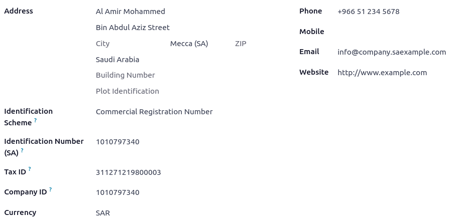
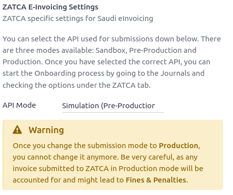

============
Saudi Arabia
============

Configuration
=============

:ref:`Install <general/install>` the following modules to get all the features of the Saudi Arabian
localization:

.. list-table::
   :header-rows: 1
   :stub-columns: 1

   * - Name
     - Technical name
     - Description
   * - Saudi Arabia - Accounting
     - `l10n_sa`
     - Default :ref:`fiscal localization package <fiscal_localizations/packages>`
   * - Saudi Arabia - E-invoicing
     - `l10n_sa_edi`
     - E-invoice implementation
   * - Saudi Arabia - E-invoicing (Simplified)
     - `l10n_sa_edi_simplified`
     - ZATCA, E-Invoicing, support for Simplified Invoices

Company information
-------------------

Configuring the company's information ensures your Accounting database is properly set up. To add
information, go to :menuselection:`Settings --> General Settings`, and in the :guilabel:`Companies`
section, click :guilabel:`Update info`. From here, fill out the fields:

- :guilabel:`Company`: full company name
- :guilabel:`Address`: the address of the company;
- :guilabel:`Identification Scheme`: company's identification scheme;
- :guilabel:`Identification Number`: Company identification's number;
- :guilabel:`VAT number`: VAT of the company;
- :guilabel:`Company Currency as SAR`: currency needs to be set as SAR.

E-Invoicing
===========

The Zakat, Tax and Customs Authorities (ZATCA) is the main regulating authority in Saudi Arabia for
customs and other taxes. Its portal facilitates numerous services for taxpayers.
If a company is already registered with ZATCA, it should then dispose of a username and a password
ready to be used for logging in Fatoora portal.

.. important::
   Ensure you are accessing the simulation part of the platform so that testing is not reflected on
   the actual platform. This step allows the flexibility to test invoicing workflows from different
   aspects without holding responsibility for the testing invoices.

For each :guilabel:`sales Journal` used on Odoo, a new device needs to be onboarded. Each journal
results in one OTP, from the Fetoora simulation portal.

.. note::
   It is common to use one :guilabel:`Journal` for each branch or shop.

In Odoo, it is necessary to activate the :guilabel:`ZATCA API Integration` and choose the API Mode
as :guilabel:`Simulation (Pre-Production)`.

